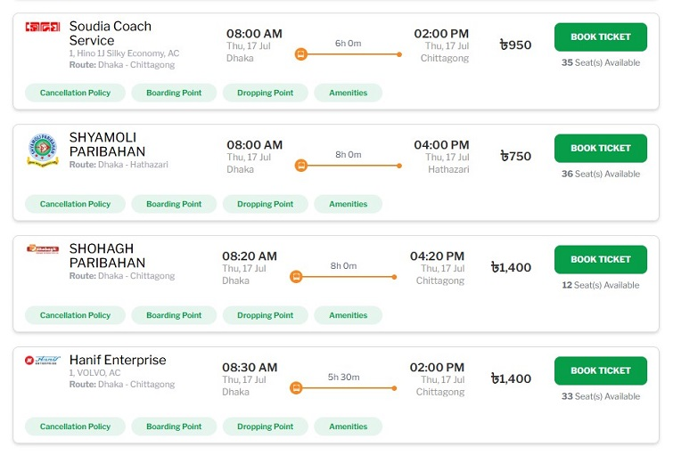

# Building web applications with React JS

!!! info "Prerequisite"
    Have a look at the [How Web Pages Work](../internet-web/web-pages.md) article as a prerequisite to this article.

In traditional web development, for each web page, developers create a single large HTML file and links CSS and JavaScript to it. In this approach, it becomes harder to add new features and to fix bugs as the application becomes larger.

React framework promotes a _modular development_ approach, meaning developing a web page in small components instead of a large single HTML file. Each component contains a part of the web page. React merges the components into a single HTML file before sending it to the user.

## Getting started with React

The best way to learn React is by creating a sample React application and experimenting with it. The following steps create a sample React application.

```bash
npm create vite@latest my-react-app -- --template react
cd my react-app
npm install
npm run dev
```

???+ question "Hands-on exercise"
    1. Create a React application with Vite using the command shown above.
    2. Open the application in VS Code and run it with `npm run dev`.
    3. Open the URL shown in the terminal (usually `http://localhost:5173`) in a web browser.
    4. Modify the `App.jsx` file in the `src` directory and see the changes in the browser.

## Two fundamental React concepts

### React components

Component is the most important React concept. A component is a JavaScript function that creates a part of a web page whenever it is called. Here follows how a basic React component function looks like:

```javascript
import React from 'react';

function App() {
  return (
    <div>
      <h1>Hello, World!</h1>
      <p>This is a simple React component.</p>
    </div>
  );
}

export default App;
```

### JSX: JavaScript XML

Notice that a component function returns JSX instead of HTML. JSX is an _extension_ of HTML. Extension means it is similar to HTML but has some additional capabilities. HTML can contain only _static_ values, but JSX may contain JavaScript expressions. Before generating HTML from JSX, React computes the value of the JavaScript expressions in the JSX and replaces the expressions with their computed values.

???+ note "Concept: JSX as a template"
    A JSX can be seen as a _template_ from which HTML can be created. The same JSX can produce different HTML outputs at different times.

## Working with React components

### General structure of a component

```javascript hl_lines="4-8 10-15"
import React, { useState } from 'react';

function Counter() {
  const [count, setCount] = useState(0);
  
  let increment= () => {
    setCount(count + 1)
  }
  
  return (
    <div>
      <p>You clicked {count} times</p>
      <button onClick={increment()}>Click me</button>
    </div>
  );
}
```

Just as the preceding example shows, any React component generally has _two parts_. In the first part, the component function performs some declarations (e.g. state variables, event handler functions, etc.), and in the last part, it returns a JSX. Depending on situation, a component may have more variables and event handlers, and the JSX may be larger, but the general structure remains the same.

Note importantly that the component function _doesn't modify any variables (props, state variables, or ref variables) in its body_; it only declares the event handler functions that modify variables. A component function only _prepares_ the component for rendering, variables can be modified _only after_ the component is rendered.

???+ question "Problem"
    Try modifying a prop or a state variable in the component function body, and see what happens.

### Nesting components: components within components

A React component may contain one more components within itself.

### Reusing components with props

We have already learned, React component functions produce parts of a web page. In many web pages, we often see _repeated parts with different data._ For example, in the following image, a bus ticket booking website displays a list of available buses in a list of cards. Each card is same in structure but contain different data for different buses.



For such scenarios, we need components whose parts are variable. In React it is done with parameterized components. Parameterized components define a parameter called `props` (short for properties). Callers of the component pass the variable parts as properties of the `props` parameter. Just as parameterized functions can be used for different inputs, components with props can also be used for different data. Such components are _reusable_, meaning a component is defined once and used many times with different data.

The following example shows how props are passed to components. Notice that parameters are passed to the `Greetings` component as attributes.

```javascript
import React from 'react';

function Greeting(props) { // can be simplified with destructuring: ({ name })
  return <h1>Hello, {props.name}!</h1>;
}

function App() {
  return (
    <div>
      <Greeting name="Alice" />
      <Greeting name="Bob" />
    </div>
  );
}

export default App;
```

### When React generates web pages from components

In a React project, we only define the component functions, but when does React generate HTML from them? It is documented in [official React docs](https://react.dev/learn/render-and-commit). Here follows a brief overview of how a web page is created by React from component:

1. When a user requests for a web page, React finds out the respective component. This phase is called _trigger._
2. After a trigger, React calls the component function. The component function evaluates the JavaScripts expressions in its JSX, if there are any and then returns the HTML string. This phase is called _rendering._
3. Then it adds the generated HTML portion into the HTML DOM using [`appendChild`](https://www.w3schools.com/jsref/met_document_createelement.asp) so that it becomes visible in the HTML page. This phase is called _commit._ .

While rendering a component, if React finds out that it contains child components, it triggers their rendering too, like a chain reaction. Those components also go through the _trigger_, _render_, and _commit_ phases.

### Managing data in components

A component contains data too. A component broadly contains two kinds of data: first, data that require re-rendering when changed, and second, data that don't require a re-render when they are changed.

#### State variables

Some components start by displaying some initial value as data, and after that user interactions (e.g., clicks) may change the data. We want the updated value to be displayed in the UI. For example, a counter component displays 0 as its initial count, and each time a button is clicked, the count increments by 1. After each click, the component should show the updated count. Displaying the updated count requires _re-rendering_ the component.

This cannot be achieved with ordinary JavaScript variables, because they do not trigger re-renders when their values change. In React, such data must be declared as _state variables._ State variables mean variables that trigger a re-render of the component when their values change.

In the following example, `count` is declared as a state variable. A state variable is declared by calling the `useState` hook function. The function takes the initial value of the variable as a parameter and returns a variable and a function for updating the variable.

```javascript
import React, { useState } from 'react';

function Counter() {
  const [count, setCount] = useState(0);

  return (
    <div>
      <p>You clicked {count} times</p>
      <button onClick={() => setCount(count + 1)}>
        Click me
      </button>
    </div>
  );
}
```

#### Ref variables

A component may also contain data that are not displayed. Their values may change with events, but the updated values don't need to be displayed. In other words, they _do not trigger re-renders when their values change_. Moreover, we want those _data to be preserved after any re-render._

Ordinary JavaScript variables are not suitable for this purpose either, because they are lost after a re-render.

```javascript
import React, { useRef } from 'react';

function Timer() {
  const countRef = useRef(0);

  const handleClick = () => {
    countRef.current += 1;
    console.log(`Button clicked ${countRef.current} times`);
  };

  return (
    <div>
      <button onClick={handleClick}>
        Click me
      </button>
    </div>
  );
}
```

???+ question "Exercise"
    Try using an ordinary JavaScript variable instead of a Ref for the same purpose and see what happens.

## Effects: post-rendering operations in components

Just as an event handler function runs after a user event (e.g., a click), React provides a way to run a function _after a component is rendered._ This is called an _effect_. _An effect is a function that runs after the component is rendered and committed._

In React components, effects are passed as a callback to `useEffect` function. React will execute the callback _after rendering and committing the component._ Notice that an event handler function is run only when the event occurs, and it may never run if the event does not occur. But an effect function always runs after the component is rendered and committed, regardless of any user event.

```javascript hl_lines="7-9"
import React, { useState, useEffect } from 'react';

function StudentDetails({ id }) {
  const [name, setName] = useState("");
  const [roll, setRoll] = useState("");

  useEffect(() => {
    // define the operations to be performed after rendering
  }, []);

  return (
    <div>
      <p>Name: {name}</p>
      <p>Roll: {roll}</p>
    </div>
  );
}
```

???+ question "Exercise"
    1. Create a React application with Vite (see [instructions above](#getting-started-with-react)).
    2. Create a component that has a state variable `count` initialized to 0.
    3. Add a button that increments the `count` variable by 1 each time it is clicked.
    4. Use an effect to log the current value of `count` to the console each time the component is rendered.
    5. Test the application.
    6. Increase the value of `count` state variable by 1 inside the effect function. Observe what happens. Explain why it happens using the knowledge of state variables, render, commit, and effects.

## Routing: navigating among components

### Background

The primary unit of a React application is a component. Learning to create components is the first step towards building React applications. So far, that has been our focus. However, that is not enough for developing real-world applications, because they consist of multiple views or pages that users can move between.

### Routing in a React application

Before using routing in a React application, let's understand what routing means in a React application. Routing means navigating between different components (views or pages) of a React application.


The preceding schematic diagram shows a sample React application with routing. The root component _App_ has two associated child components: _Products_ and _About_. It also contains two navigation links to navigate to the components. Similarly, the _Products_ component has three other child components: _P1_, _P2_, and _P3_. It also has three navigation links to its child components.

Notice that the root component, _App_, has a region called _"outlet"_ to render its child components. The outlet may _display any one of its two child components at a time_ depending on the link clicked. Similarly, the _Products_ component also has an outlet to render its child components.


The tree diagram above shows the mapping between URLs and components of the sample React application. Now, to enable routing in the React application, two things need to be done:

1. All of these URL-component mappings, that is, the tree diagram above, have to be passed to the React application so that it _knows_ which component to [trigger and render](#how-react-generates-web-pages-with-components) when a user clicks a link.
2. Each component that has child components must contain navigation links and an outlet to render the child components.

### Installing React Router

By default, a React application does not support routing. To add routing capabilities, we need to install a routing library. [React Router](https://reactrouter.com/home) is a popular library for handling routing in React applications. To install React Router in a React app, use the following command:

```bash
npm install react-router
```

### Configuring routing

As mentioned earlier, the mapping between URLs and components has to be passed to the React application first. It is done at the entry point of the application, usually in the `main.jsx` file. The following example shows how to configure routing in a React application.

```jsx hl_lines="13-42 46-46"
import { StrictMode } from 'react'
import { createRoot } from 'react-dom/client'
import './index.css'
import { RouterProvider } from 'react-router/dom'
import { createBrowserRouter } from 'react-router'
import App from './App.jsx'
import Products from './Products.jsx'
import About from './About.jsx'
import Product1 from './Product1.jsx'
import Product2 from './Product2.jsx'
import Product3 from './Product3.jsx'

const router = createBrowserRouter([
  {
    path: '/',
    element: <App />,
    children: [
      {
        path: 'products',
        element: <Products />,
        children: [
          {
            path: 'p1',
            element: <Product1 />,
          },
          {
            path: 'p2',
            element: <Product2 />,
          },
          {
            path: 'p3',
            element: <Product3 />,
          }
        ]
      },
      {
        path: 'about',
        element: <About />,
      },
    ],
  },
]);

createRoot(document.getElementById('root')).render(
  <StrictMode>
    <RouterProvider router={router} />
  </StrictMode>,
)
```

The highlighted `router` variable portion essentially _constructs the route tree of the application_. Then the tree is feed into the application using the `RouterProvider` component (highlighted).

### Enabling navigation

Configuring routing just passes the mapping between URLs and components to the application. To navigate between components, we need to add navigation links in the parent component and an outlet to render the child components.

```jsx hl_lines="6-7 9-9"
import { NavLink, Outlet } from 'react-router';

function App() {
  return (
    <>
      <NavLink to="/products">Products</NavLink> |{' '}
      <NavLink to="/about">About</NavLink>

      <Outlet />
    </>
  )
}

export default App
```

???+ question "Exercise"
    1. Create a React application with Vite (see [instructions above](#getting-started-with-react)).
    2. Install React Router: `npm install react-router`
    3. Create some components (e.g., Home, About). Keep them as simple as possible. Their content is not important for this exercise.
    3. Configure various routing combinations in the `main.jsx` file.
    4. Add navigation links and an outlet in the parent component.
    5. Test the application by clicking the navigation links.
    6. Delete the created application and recreate it from scratch to practice again until you feel comfortable with routing in React.

## Client-side Rendering (CSR) and Server-side Rendering (SSR)

Generating HTML using JavaScript functions demo.

## React workflow

Divide planned web pages into components and develop the components first. Then compose the components together.
