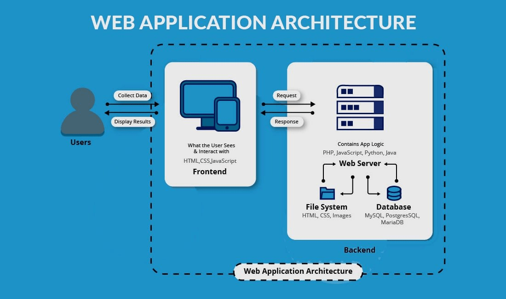

# Web Applications

!!! info
    Have a look at the [How Websites Work](../internet-web/websites.md) article as prerequisites to this article.

## Web Application Architecture

Architecture means how the various components of an application are organized and how they interact with each other. An web application consists of the following components: client, server, and database.

The preceding diagram shows the diagram of a sample web application.
