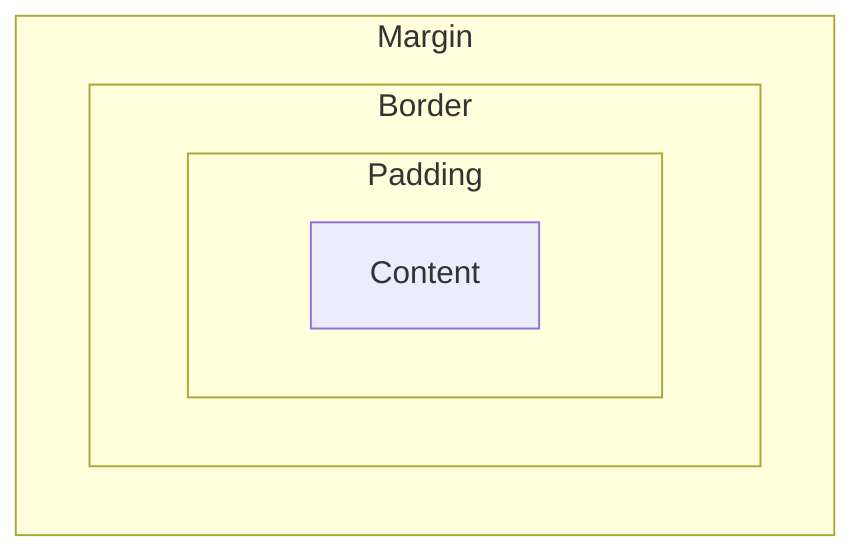

# How Web Pages Work

A web page is primarily an HTML document. A server only [transfers the HTML document](./web-servers.md#how-an-http-server-serves-websites) and related files to the browser when a user requests a web page. The HTML document contains the content that the user sees on the web page.

## The fundamental building blocks of a web page

A web page is made up of the following fundamental building blocks:

* _HTML document._ For displaying the content to the user.
* _Images._ For displaying images on the page.
* _CSS._ For styling the content.
* _JavaScript._ For making the web page interactive.

Besides an HTML file, a complex web page needs some additional files (images, CSS files, scripts, etc.), called *linked resources.* The HTML document is the nucleus of a web page. It glues all these resources together to form a complete web page. The next section explains how an HTML document links these resources.

### Linking resources with an HTML file

The resources needed by an HTML are specified with the `<link>` tag within the `<head>` tag of the HTML document. In the following example, a CSS file named `style.css` is specified as an external resource with the `<link>` tag.

```html
<head>
  <link rel="stylesheet" type="text/css" href="style.css">
</head>
```

An HTML may also need JavaScript files. The linking rule is bit different for them. They are specified as external resources with the `<script>` tag. In the following example, a JavaScript file named `script.js` is specified as an external resource with the `<script>` tag.

```html
<head>
  <script src="script.js"></script>
</head>
```

The external resources are usually stored in the server's [static directory](web-servers.md#serving-static-contents), but can be in an external server too. After receiving an HTML, browsers [send requests to the server](./web-servers.md#how-an-http-server-serves-websites) for each of the specified resources.

???+ info "Passing CSS and JavaScript within HTML"

    CSS and JavaScript can also be passed within the HTML document itself, instead of linking them as external resources. This approach is suitable for small CSS and JavaScript codes. This is done with the `<style>` and `<script>` tags, respectively. An example follows:

    ```html
    <html>
    <head>
      <style>
        body {
          background-color: lightblue;
        }
      </style>
      <script>
        function greet() {
          alert("Hello, World!");
        }
      </script>
    </head>
    <body onload="greet()">
      <h1>Welcome to My Web Page</h1>
      <p>This is a simple web page.</p>
    </body>
    </html>
    ```

## How web pages are developed

To create a web page, a programmer has to create an HTML file for it, containing the content that she wants to show to the users. She may also create additional files, such as CSS files for styling the page and JavaScript files for adding interactivity to the page. We will learn about them later. Then all these files are put in an HTTP server's [static directory](./web-servers.md#serving-static-contents). It is a _one-time_ job. 

After that, whenever a user requests the web page, the server returns the HTML file. How a web server does it is explained in [How an HTTP server serves websites](./web-servers.md#how-an-http-server-serves-websites). In the following sections, we will see how HTML, CSS, and JavaScript work together to create a complete web page.

???+ info "The Live Server VSCode extension"

    Setting up an HTTP server takes some time. The [Live Server](https://marketplace.visualstudio.com/items?itemName=ritwickdey.LiveServer) VSCode extension simplifies the job for programmers. It turns the directory open in VSCode (_working directory_) into an HTTP server's [static directory](web-servers.md#serving-static-contents) in a click. As a result, programmers can experiment more frequently.
    
    Install the Live Server extension in VSCode if it is not already installed. Use it for doing the exercises on this page.

??? question "Hands-on exercise: Using Live Server in VSCode"

    * Create an HTML file, a CSS file, and a JavaScript file.
    * [Link](#linking-resources-with-an-html-file) the CSS and the JavaScript files with the HTML file.
    * Run Live Server and access the HTML from a web browser.


## Defining page contents with HTML

HTML defines the content of a web page, which means the things we want to show to the user on browser. Browser knows how to read an HTML document and display it to the user.

### How HTML forms work

A website not only _displays data_ to users. It also _takes data_ from users. In HTML, forms are used for that. A form is just an HTML element. It has a number of nested input elements of various types and a submit button. When a user clicks the submit button, all the inputs in the form are passed (*submitted*) to the server through an HTTP request.

A server has a URL for receiving the form data. The URL is set in the `action` attribute (e.g., `<form action="/submit">`) of the form. Additionally, the request method (either `GET` or `POST`) can also be set with the `method` attribute (e.g., `<form action="/submit" method="POST">`). When a user submits the form, the browser sends an HTTP request to the `action` URL with the form fields included in the request body.

???+ question "Hands-on exercise"

    * Create a simple HTML form with some sample input fields (e.g., name, email, age, etc.) and a submit button.
    * Specify a URL in the `action` attribute and a request method in the `method` attribute of the form.
    * Open the HTML file in a browser, fill out the form, and click the submit button.
    * Check in the browser's developer tools (Network tab) to see the HTTP request made to the specified URL, and also observe how the form fields are passed with the request.

## Styling web pages with CSS

By default, without any styling, a web page looks plain and unappealing. To make it visually attractive, _CSS_ (Cascading Style Sheets) is used. 

CSS controls the look of an HTML element with its _style properties_: e.g., the text color, background color, font size, etc. CSS has lots of predefined style properties that can control various style aspects of HTML elements (e.g., color, layout, spacing, positioning, etc.). For example, the `color` property sets the text color, and the `background-color` property sets the background color of an element.

This simple idea styles all the complex and attractive web pages we see in the internet.

### CSS selectors

Style properties are grouped under _selectors._ A selector determines the _scope_ of the style properties, that is, to which HTML elements the style properties apply. In the following example, the `body` selector sets the background color of the entire page, and the `h1` selector sets the text color of all `<h1>` elements. The properties under the `body` selector apply to the `<body>` element, and the properties under the `h1` selector apply to all `<h1>` elements in the HTML document:

```css
body {
  background-color: lightblue;
}

h1 {
  color: darkblue;
}
```

Notice that selectors like `body` and `h1` have _too broad a scope_. They apply to _all elements_ of those types in the document. Two additional CSS selectors give more _fine-grained_, that is, more specific, control over their scopes: the class selector and the id selector.

#### The class selector

The `.class` selector selects all elements with a specific `class` attribute. For example, `.highlight` selects all elements with `class="highlight"`.

In the following example, the `.highlight` selector sets the background color of all elements with `class="highlight"` to yellow, and the `#header` selector sets the text color of the element with `id="header"` to red:

```css
.highlight {
  background-color: yellow;
}
```

Note that in an HTML document, multiple elements can have the same `class` attribute. So, a CSS class selector style applies to all those elements.

Also note that an HTML element can have multiple classes. For example, `<div class="highlight important">` has two classes: `highlight` and `important`. The `div` element will get the styles defined for both classes.

#### The id selector

The `#id` selector selects an element with a specific `id` attribute. For example, `#header` selects the element with `id="header"`.

```css
#header {
  color: red;
}
```

Note that in an HTML document, `id` attributes are unique, meaning that only one element can have a specific `id`. So, a CSS id selector style applies to only one element.

??? note "Concept: class and id selectors as _associations_"

    As we have seen in this section, in an HTML document, only one element can have a specific `id`. On the other hand, multiple elements may have the same `class`. In terms of [_association_ or _mapping_](../programming/mental-models.md#associations-or-maps), an id has a _one-to-one mapping_ with an HTML element, while a class has a _one-to-many_ mapping with HTML elements.

### The box model

CSS views an HTML element as contained in a rectangular box. This box has four parts: _content_, _padding_, _border_, and _margin_. Those four parts can be controlled with CSS properties. The way these boxes are displayed on the page is called the _CSS box model_.

The following diagram illustrates the box model:



Here is a table summarizing the four parts of the box model:

| # | Part      | Description | Controlling properties |
|---|-----------|-------------|------------------------|
| 1 | _Content_ | The actual content inside the element, such as text, images, or other elements. | `width`, `height` |
| 2 | _Padding_ | The space between the content and the element's border, creating inner spacing around the content. | `padding` (e.g., `padding: 10px;`) |
| 3 | _Border_  | The border that wraps around the padding and content, which can be styled. | `border-width`, `border-style`, `border-color` |
| 4 | _Margin_  | The space outside the border, separating the element from other elements, creating outer spacing around the element. | `margin` (e.g., `margin: 20px;`) |

#### Example

Here follows a sample CSS code that demonstrates the box model. Use it on a simple HTML document to see how the box model works:

```css
div {
  width: 200px; /* Content width */
  height: 100px; /* Content height */
  padding: 20px; /* Space inside the border */
  border: 5px solid black; /* Border around the element */
  margin: 10px; /* Space outside the border */
}
```

## Client-side JavaScript

Just like without CSS a web page looks plain, without interactivity, response to user actions, a web page is static and unresponsive. Without interactivity, a web page is just a collection of text and images. Users can only read the text, see the images, and go to other pages. In the early days of the web, web pages were designed to display text and images.

These days, web pages are not limited to just displaying text and images. Complex applications are built as web pages. These applications must be able to respond to user actions, such as when a user clicks a button, inputs text, and submitting forms. This is where client-side JavaScript comes in.

Before getting into how JavaScript makes web pages interactive, just keep in mind that _every browser can run JavaScript programs (see the info box below for details)_.

??? note "Concept: Browser as a JavaScript runner"

    JavaScript was originally designed only for running in browsers and remained so for a long time, NodeJS came later.

    Where NodeJS can run *any* JavaScript file chosen by the user, with the `node file.js` command, browsers can *only* run JavaScript files [included to an HTML file](#linking-resources-with-an-html-file). JavaScript running on a browser is called *client-side JavaScript* or *browser JavaScript*, and running on a server with NodeJS is called *server-side JavaScript.* As we will see, client-side JavaScript [works together with an HTML document](#how-html-and-client-side-javascript-work-together) and helps in making web pages interactive.

    Users can interact with client-side JavaScript from browser console. That means users can access the variables and functions defined in the JavaScript files linked to the HTML document.

    ??? question "Hands-on exercise: Accessing JavaScript from browser console"
        
        1. Create an HTML file and a JavaScript file [linked](#linking-resources-with-an-html-file) to it.
        2. Define some variables and a function in the JavaScript file.
        3. Access the HTML file from a browser and open browser console.
        4. Print the variables on console.
        5. Call the functions and print their return values on console.

### Event handling: calling JavaScript from HTML

HTML elements can associate functions with its _events_; those functions are called _event handlers._ For example, `<element onclick="function1()"/>` means call `function1` when element is clicked; `<element onload="function2()"/>` means call `function2` when element loads. Here both `function1` and `function2` are defined in the linked JavaScript files. Here is an exhaustive list of [HTML events](https://www.w3schools.com/jsref/dom_obj_event.asp).

An HTML file may have one or more [linked JavaScript files](#linking-resources-with-an-html-file) containing the functions associated with various events in the HTML file. Functions have access to the HTML document with the `document` object. HTML elements can be accessed with the `document` object in [several ways](https://www.w3schools.com/js/js_htmldom_document.asp): `document.getElementById` is a popular way.

The architecture in summary: _perform some operation (function) when something happens (event) to an element._

### JavaScript DOM: accessing HTML from JavaScript

Most importantly, client-side JavaScript has access to the HTML document's _object representation_, called [DOM](https://www.w3schools.com/js/js_htmldom.asp) (Document Object Model), through a special object named `document`. The object is created automatically and is accessible from everywhere in any client-side JavaScript file.

Elements of the HTML document can be read and modified through the `document` object. Therefore, it is the link between the HTML document and client-side JavaScript. Whenever accessing and manipulating the HTML document with client-side JavaScript is needed, use the `document` object. This allows JavaScript to dynamically change the content, structure, and style of a webpage.

??? note "Concept: JavaScript DOM as an _API_"

    The JavaScript DOM, or the `document` object, represents an important programming concept called an [_API_ (Application Programming Interface)](../building-softwares/software-dev-concepts.md#api-application-programming-interface). A programmer will encounter this concept frequently. A clear understanding of it is important.

    The JavaScript `document` object allows any JavaScript code to communicate with the HTML document. The `document` object has methods, like `getElementById`, that allow accessing elements of the HTML document. It also has methods to modify the HTML document, like `createElement`, `appendChild`, etc.
 
    Without the `document` object, programmers would have to write complex code to access and modify the HTML document. The `document` object removes that complexity and provides a simple way to interact with the HTML document. Therefore, the `document` object is an API that allows JavaScript functions to communicate with the HTML document.

### Applications of client-side JavaScript

We have learned that [DOM](#javascript-dom-accessing-html-from-javascript) allows us to access HTML from JavaScript and [event handling](#event-handling-calling-javascript-from-html) lets call JavaScript functions from HTML.

#### Validating forms with client-side JS

A common use of client-side JavaScript is in *validating* HTML forms. Users may input incorrect data or forget to input mandatory data while filling out forms. Checking form inputs before sending them to a server is called validation. Before we see how client-side JavaScript validates forms, have a look at [how HTML forms usually work](#how-html-forms-work).

In a usual HTML form, after a user submits a form, input data is sent to the server just as they are, without any check at the browser. In this approach, only the server can validate the form data. Now, we can use the event and event handler approach described [in the previous section](#how-html-and-client-side-javascript-work-together) to validate form inputs at browser, before sending to a server.

Notice that each input element in a form and the form itself are all HTML elements. Therefore, just like any other HTML elements, they can all have their own events and event handlers. Among the events, the following can be used for validating form inputs.

| Element | Event      | Description | Example
|---------|------------|-------------|----------
| Input   | `onchange` | This event occurs when the value of an input element changes and the element loses focus, meaning user goes from one field to another. | `<input type="text" onchange="validateName()">` or `<input type="text" onchange="validateName(event)">`
| Input   | `oninput`  | This event occurs when the value of an input element changes, meaning as user types in or deletes characters. | `<input type="text" oninput="validateEmail()">` or `<input type="text" onchange="validateEmail(event)">`
| Form    | `onsubmit` | This event occurs when user clicks the submit button of a form. | `<form onsubmit="validateForm()">` or `<form onsubmit="validateForm(event)">`

Now, notice that for each input element, we can use the `onchange` or `oninput` event handler functions to validate the input value. Inside the event handler functions, we can access the input values, using either `document` object or `event` parameter (see the info box below), and check whether they are correct or not.

??? info "Accessing input values in event handler functions"

    In an event handler function, we can access the HTML element that triggered the event in two ways:

    1. **Using the `document` object:** We can use methods like `document.getElementById` to get the element and then access its value using the `value` property. For example, if an input element has `id="name"`, we can get its value with `document.getElementById("name").value`.
    2. **Using the `event` parameter:** When an event handler function is called, it receives an `event` object as a parameter. This object contains information about the event, including the target element that triggered the event. We can access the value of the input element using `event.target.value`. _Note:_ in this case, the event handler function must declare the `event` parameter, and the HTML element must call the function with the `event` argument, e.g., `onchange="validateName(event)"`.

Similarly, we can use the `onsubmit` event handler of the form element to validate the entire form. This function can prevent form submissions if any of the input values are invalid.

??? question "Hands-on exercise: validate a form"

    Create a simple HTML form with the following fields: _Name (text)_, _Email (text)_, _Age (number)_, and a Submit button. Define event handler functions for the following elements and events to validate the inputs:

    | element | event     | Validation logic
    |---------|-----------|------------------
    | _Name_  | `onchange` and `oninput`  | Check that the name is not empty.
    | _Email_ | `onchange` and `oninput`  | Check that the email is in a valid email format, containing `@` and `.`
    | _Age_   | `onchange` and `oninput`  | Check that the age is a number between 1 and 120.
    | _Form_  | `onsubmit` | Check that all fields are valid before allowing submission.

    Implement the following operations in each event handler function:

    1. Print a message on console just to check that the function is called actually.
    2. Access and print the input values on console using `document` object.
    3. Access and print the input values on console using `event` parameter.
    4. Check the respective input values according to the validation logic in the table above.
    5. Observe and distinguish between the `onchange` and `oninput` event handler behaviors.

## Developing basic web pages

Knowledge of HTML, CSS, and JavaScript is enough to create a basic web page: create an HTML file; create a CSS file for styling it; create a JavaScript file for various event handling; and link the CSS and JavaScript files to the HTML document. Put those files in a [server static directory](./web-servers.md#serving-static-contents) for serving to the client. This architecture can develop fairly complex web pages. In fact, that is how web pages were built for a long time.
