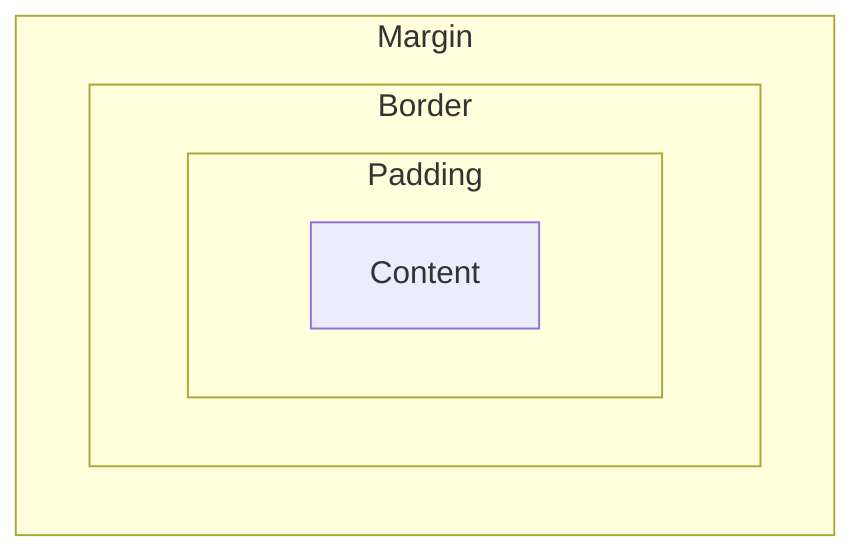

# How Web Pages Work

A web page is primarily an HTML document. A server only [transfers the HTML document](./web-servers.md#how-an-http-server-serves-websites) and related files to the browser when a user requests a web page. The HTML document contains the content that the user sees on the web page.

## The fundamental building blocks of a web page

A web page is made up of the following fundamental building blocks:

* _HTML document._ For displaying the content to the user.
* _Images._ For displaying images on the page.
* _CSS._ For styling the content.
* _JavaScript._ For making the web page interactive.

The HTML document is the main file of a web page. But a complex web page needs some additional files (images, CSS files, scripts, etc.), called *linked resources.*

### Linking resources with HTML

The resources needed by an HTML are specified with the `<link>` tag within the `<head>` tag of the HTML document. The external resources are usually stored in the server's [static directory](web-servers.md#serving-static-contents), but can be in an external server too. After receiving an HTML, browsers [send requests to the server](./web-servers.md#how-an-http-server-serves-websites) for each of the specified resources.

An HTML may also need JavaScript files. They are specified as external resources with the `<script>` tag.

!!!info
    **Passing CSS and JavaScript within HTML**

    CSS and JavaScript can also be passed within the HTML document itself, instead of linking them as external resources. This is done with the `<style>` and `<script>` tags, respectively. Example follows:

    ```html
    <html>
    <head>
      <style>
        body {
          background-color: lightblue;
        }
      </style>
      <script>
        function greet() {
          alert("Hello, World!");
        }
      </script>
    </head>
    <body onload="greet()">
      <h1>Welcome to My Web Page</h1>
      <p>This is a simple web page.</p>
    </body>
    </html>
    ```

## Styling web pages with CSS

By default, without any styling, a web page looks plain and unappealing. To make it visually attractive, _CSS_ (Cascading Style Sheets) is used. 

CSS controls the look of an HTML element with its _style properties_: e.g., the text color, background color, font size, etc. CSS has lots of predefined style properties that can be applied to HTML elements. For example, the `color` property sets the text color, and the `background-color` property sets the background color of an element.

This simple idea styles all the complex and attractive web pages we see in the internet.

### CSS selectors

Style properties are grouped under _selectors._ A selector determines the elements to which the style properties apply. For example, the `body` selector selects the `<body>` element, and the `h1` selector selects all `<h1>` elements in the HTML document. In the following example, the `body` selector sets the background color of the entire page, and the `h1` selector sets the text color of all `<h1>` elements:

```css
body {
  background-color: lightblue;
}

h1 {
  color: darkblue;
}
```

Two additional CSS selectors are frequently used: the class selector and the id selector. They give more control over which elements to style.

#### The class selector

The `.class` selector selects all elements with a specific `class` attribute. For example, `.highlight` selects all elements with `class="highlight"`.

In the following example, the `.highlight` selector sets the background color of all elements with `class="highlight"` to yellow, and the `#header` selector sets the text color of the element with `id="header"` to red:

```css
.highlight {
  background-color: yellow;
}
```

#### The id selector

The `#id` selector selects an element with a specific `id` attribute. For example, `#header` selects the element with `id="header"`.

```css
#header {
  color: red;
}
```

!!! info

    **Scopes of class and id selectors**

    In an HTML document, `id` attributes of elements are unique, meaning that only one element can have a specific `id`. Therefore, a CSS id selector selects only one element. In contrast, `class` attributes can be shared by multiple elements, so a CSS class selector can select multiple elements. This is why the id selector is more specific than the class selector. In other words, an id selector has a [one-to-one mapping](../programming/mental-models.md#associations-or-maps) with an HTML element, while a class selector has a [one-to-many](../programming/mental-models.md#associations-or-maps) mapping with HTML elements.

### The box model

CSS views an HTML element as contained in a rectangular box. This box has four parts: _content_, _padding_, _border_, and _margin_. Those four parts can be controlled with CSS properties. The way these boxes are displayed on the page is called the _CSS box model_.

The following diagram illustrates the box model:



Here is a table summarizing the four parts of the box model:

| # | Part      | Description | Controlling properties |
|---|-----------|-------------|------------------------|
| 1 | _Content_ | The actual content inside the element, such as text, images, or other elements. | `width`, `height` |
| 2 | _Padding_ | The space between the content and the element's border, creating inner spacing around the content. | `padding` (e.g., `padding: 10px;`) |
| 3 | _Border_  | The border that wraps around the padding and content, which can be styled. | `border-width`, `border-style`, `border-color` |
| 4 | _Margin_  | The space outside the border, separating the element from other elements, creating outer spacing around the element. | `margin` (e.g., `margin: 20px;`) |

#### Example

Here follows a sample CSS code that demonstrates the box model. Use it on a simple HTML document to see how the box model works:

```css
div {
  width: 200px; /* Content width */
  height: 100px; /* Content height */
  padding: 20px; /* Space inside the border */
  border: 5px solid black; /* Border around the element */
  margin: 10px; /* Space outside the border */
}
```

## Browser as a JavaScript runner

Like NodeJS (the `node` command), every browser can run JavaScript programs too. In fact, JavaScript was originally designed only to be run on browsers and remained so for a long time, NodeJS came later.
    
Where NodeJS can run *any* JavaScript file, browsers can *only* run JavaScript files included in HTML files. JavaScript running on a browser is called *client-side JavaScript*, and running on a server with NodeJS is called *server-side JavaScript.* As we will see, client-side JavaScript works together with the HTML document and helps in making web pages interactive.

Users can interact with client-side JavaScript from browser console. That means users can access the variables and functions defined in the JavaScript files linked to the HTML document.

### JavaScript DOM

Most importantly, client-side JavaScript has access to the HTML document's _object representation_, called [DOM](https://www.w3schools.com/js/js_htmldom.asp) (Document Object Model), through a special object named `document`. The object is created automatically and is accessible from everywhere in any client-side JavaScript file.

Elements of the HTML document can be read and modified through the `document` object. Therefore, it is the link between the HTML document and client-side JavaScript. Whenever accessing and manipulating the HTML document with client-side JavaScript is needed, use the `document` object. This allows JavaScript to dynamically change the content, structure, and style of a webpage.

## How HTML and client-side JavaScript work together

HTML elements can associate functions with its _events_; those functions are called _event handlers._ For example, `<element onClick="function1()"/>` means call `function1` when element is clicked; `<element onLoad="function2()"/>` means call `function2` when element loads. Here both `function1` and `function2` are defined in the linked JavaScript files. Here is an exhaustive list of [HTML events](https://www.w3schools.com/jsref/dom_obj_event.asp).

An HTML file may have one or more associated JavaScript files containing the functions associated with various events in the HTML file. Functions have access to the HTML document with the `document` object. HTML elements can be accessed with the `document` object in [several ways](https://www.w3schools.com/js/js_htmldom_document.asp): `document.getElementById` is a popular way.

The architecture in summary: _perform some operation (function) when something happens (event) to an element._

## Applications of client-side JavaScript

### Validating forms with client-side JS

Client-side JavaScript has its application in *validating* HTML forms. Users may input incorrect data or forget to input mandatory data in forms. The user inputs have to be checked (called *validation*) before storing in database.

!!!info
    **How HTML forms work.**

    Forms are used to accept inputs from user and passing them to server for storing in database. A form contains a number of inputs of various types and a submit button. When user clicks the submit button, the inputs are passed (*submitted*) to the server.

    A server has a URL that handles the form data. The URL that handles the form data is specified in the `action` attribute (e.g., `<form action="/submit">`). The request method can also be specified with the `method` attribute (e.g., `<form action="/submit" method="POST">`. Method can be either `GET` or `POST`. Upon submitting the form, the form fields are converted into a request body and sent to the server at the specified URL. The server processes the request and returns a response.

In a simple HTML form, upon submission form data is sent to the server. The server then validates the form data. This approach incurs unnecessary network travel costs and server resources.

If the form data could be validated at the browser, before submitting to the server, both network travel and server processing could be avoided. Client-side JavaScript is very useful for this purpose: write a JavaScript function that contains the logic to validate the form. In the function, find the form element using the `document` object, and after that, access and check the form input values. Call the function when the user clicks the submit button. Pass the form to the server only after the function finds no error in the inputs.

## Developing basic web pages

Create an HTML file; create a CSS file for styling it; create a JavaScript file for various events handling; link the CSS and JavaScript files to the HTML document. Put those files in a [server static directory](./web-servers.md#serving-static-contents) for serving to the client. This architecture can develop fairly complex web pages. In fact, that is how web pages were built for a long time.
