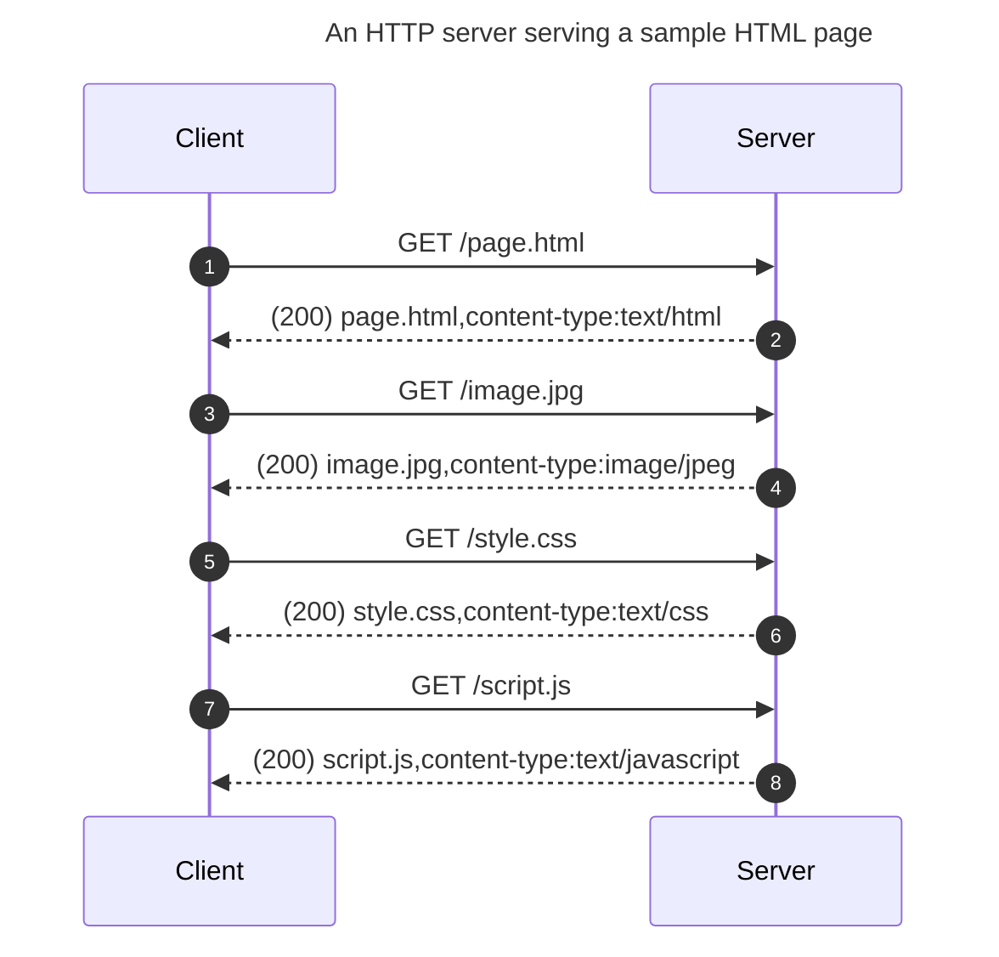

# How Web Servers Work

!!! info
    Have a look at the [Network & Internet Basics](./network-internet-basics.md) and [Working with HTTP](./http-in-depth.md) articles as prerequisites to this article.

## How an HTTP server serves websites

HTTP responses may contain many types of contents in their bodies and the content's type is indicated by the `Content-Type` header. Websites are nothing but a particular type of HTTP response that contains an HTML document in its body and its `Content-Type` header is set to `text/html`. A browser knows how to render an HTML page. An HTML page may refer to some other resources in it, like images, fonts, stylesheets, scripts, etc. After downloading a page, browsers download all resources associated with the page by separate automatic subsequent requests.

The following sequence diagram shows how an HTML page (`/page.html`) is served by a server.



The client (browser) sends a request for the `/page.html` page to the server; the server returns the page in response. The browser finds that the HTML file refers to some other resources too, like an image (`image.jpg`), a stylesheet file (`style.css`), a script (`script.js`), etc. The browser makes requests for each of them to the server and the server returns them in response.

## Static vs. dynamic contents

An HTTP server serves largely two types of content: _static_ and _dynamic_.

### Serving static contents

For static contents (also called _static assets_ or just _assets_), programmers use a server directory dedicated for serving static contents. All the static assets to be served (e.g., images, fonts, stylesheets, etc.) are put in the directory. Web servers allow programmers to specify a directory for static contents; the exact instructions vary from server to server. If the requested URL matches a file in the directory, the server returns a response with the file's content as its body.

Here follows an example directory (`static/`) and its contents on a server running at `localhost:5000`:

```
static/
  index.html
  style.css
  image.jpg
  page.html
  sub-dir/
    index.html
    style-2.css
    page-2.html
  sub-dir-2/
    image-1.jpg
    image-2.png
```

For example, if a client requests the URL `http://localhost:5000/image.jpg`, the server returns a response that contains the `image.jpg` file's content as its body. Similarly, the `style-2.css` file is returned for the URL `http://localhost:5000/sub-dir/style-2.css`.

!!! info
    **The `index.html` convention for directories.**

    As a convention, if a directory is requested instead of a file, like `http://localhost:5000/sub-dir/`, the `index.html` file within the directory is returned.

### Serving dynamic contents

Dynamic content, on the other hand, is _generated_ by a server upon receiving a request. In a modern web server, for each URL, programmers define a function associated with the URL that can _generate_ a response. Whenever a request is sent to a URL, the function associated with it generates the response and returns it to the client.

Unlike static contents, the same URL may return different responses at different times, depending on the data available to the server at that time. For example, a URL like `http://localhost:5000/products/123` may return a product page for product ID `123` at one time and a different product page for the same product ID at another time.

???+ info
    **Progressive Web Applications (PWA)**

    In the last few years, a new trend has emerged for dynamically generating HTMLs in browsers. In this technique, the HTML body generation logic is written in JavaScript and linked in an HTML with an empty body except a `div`, as is done in the following example. After a browser loads this HTML, the JavaScript file generates the whole HTML body.

    ```html
    <html>
      <head>
         <title>Page title</title>
         <link rel="preload" as="script" href="/static/pwa-app.js">
      </head>
      <body><div id="app"></div><body>
    </html>
    ```

    Several frameworks, like React and Vue, support building PWAs. A detailed treatment of PWA is out of the current article's scope.

## Website performance

Several factors affect a website's performance, that is, how fast a website can return responses. A developer should be aware of them and a few common techniques used to mitigate them.

### Repeated access to the same data

Observe that many contents are repeated, like logo images and stylesheets, across pages in a website. For example, different pages in `wikipedia.org` use the same logo and styles. Therefore, for each page, browsers are supposed to download those same data from the server. Fortunately, browsers and servers together employ _caching_ as a technique to avoid the repeated requests for the same data.

In caching, both browser and server have their roles. Browsers _cache_ HTTP responses, which means they store the responses locally. Servers avoid sending data that a client requested earlier unless there are changes to it since the last time; on such occasions, they signal the browser that the requested data has no changes and as a result, browsers reuse the cached data.

Let's say that a browser has received some data, say, an image, from a server and cached it as usual. When the browser requests the same data again and the server finds that the data hasn't changed since the client last requested it, the server doesn't send the data again. Instead, the server returns a response with status code [304 (not modified)](https://developer.mozilla.org/en-US/docs/Web/HTTP/Status/304) and _without a body_, resulting in a _smaller response size._

The [status code 304 tells](./http-in-depth.md#status-codes) the client that it may use its cached version of the data as it hasn't changed on the server. On the other hand, if the server detects that the data has changed, it returns a usual response with status code `200` (OK) and the data included in the response body. This technique is particularly useful for static data that hardly changes (e.g., images, stylesheets, etc.). A hard refresh (Ctrl+Shift+R) clears the browser cache and makes the browser download all the data again.

### Response size

Both HTTP requests and responses travel over networks. An HTTP client downloads the HTTP responses on the client computer. The response size affects the download speed: a response with a larger body takes longer to download.

Compression and minification are two commonly used optimization techniques to reduce the HTTP response size.
