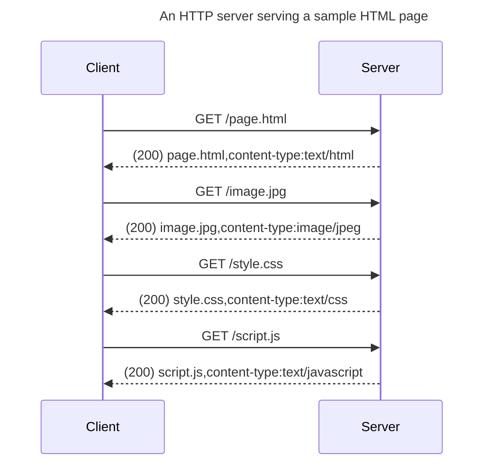

# How websites work

!!! info
    Have a look at the [Network & Internet Basics](./network-internet-basics.md) and [Working with HTTP](./http-in-depth.md) articles as prerequisites to this article.

## How an HTTP server serves websites

HTTP responses may contain many types of contents in their bodies and the content's type is indicated by the `Content-Type` header. Websites are nothing but a particular type of HTTP response that contains an HTML document in its body and its `Content-Type` header is set to `text/html`. A browser knows how to render an HTML page. An HTML page may refer to some other resources in it, like images, fonts, stylesheets, scripts, etc. After downloading a page, browsers download all resources associated with the page by separate automatic subsequent requests.

The following sequence diagram shows how an HTML page (`/page.html`) is served by a server.

The client (browser) sends a request for the `/page.html` page to the server; the server returns the page in response. The browser finds that the HTML file refers to some other resources too, like an image (`image.jpg`), a stylesheet file (`style.css`), a script (`script.js`), etc. The browser makes requests for each of them to the server and the server returns them in response.

## Website performance

Several factors affect a website's performance. A developer should be aware of them and a few common techniques used to mitigate them.

### Response size

Both HTTP requests and responses travel over networks. An HTTP client downloads the HTTP responses on the client computer. The response size affects the download speed: a response with a larger body takes longer to download.

_Caching_ is used as a performance optimization technique to avoid downloading the same response repeatedly. In this technique, both browser and server have their roles. Browsers _cache_ HTTP responses, which means they store the responses locally. Servers avoid sending data that a client requested earlier unless there are changes to it since the last time; on such occasions, they signal the browser that the requested data has no changes and browsers reuse the cached data.

Let's say that a browser has received some data, say, an image, from a server and cached it as usual. When the browser request for the same data again and the server finds that the data hasn't changed since the client last requested it, the server doesn't send the data again. Instead, the server returns a response with status code [304 (not modified)](https://developer.mozilla.org/en-US/docs/Web/HTTP/Status/304) and _without a body_, resulting in a _smaller response size._

The [status code 304 tells](./http-in-depth.md#status-codes) the client that it may use its cached version of the data as it hasn't changed on the server. On the other hand, if the server detects that the data has changed, it returns a usual response with status code `200` (OK) and the data included in the response body. This technique is particularly useful for static data that hardly changes (e.g., images, stylesheets, etc.). A hard refresh (Ctrl+Shift+R) clears the browser cache and makes the browser download all the data again.
