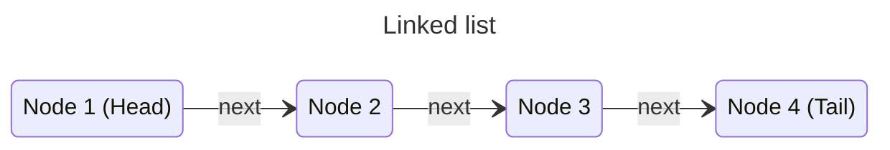

In programs, data is organized based on various scenarios. The techniques of representing data in programs are called data structures. Each data structure vary from the other and are suitable for different scenarios.

A few commonly used data structures are the following:

1. Arrays.
2. Stacks.
3. Queues.
4. Linked lists.
5. Maps.
6. Graphs.

## Linked lists

In the _linked list_ data structure data is organized as sequential _nodes_. Each node contains some data and points (links) to its next node. The first node is called the _head_ of the linked list, and the last node, which points to no node, is called its _tail_.

In order to use a linked list, programmers have to keep track of its head and tail nodes.

### Inserting elements

In a linked list one node is appended to it at a time by updating its tail. The new node becomes the new tail of the list.

### Traversal

Traversing a linked list begins by setting the head as the _current_ node. After that, each time, the current node is updated to the next node until the current node points to nothing.

As we can see, a linked list can be traversed only in a _forward direction,_ where an array can be traversed in both directions. Moreover, in an array, any element can be accessed by its index, whereas in a linked list, a node can be reached only by _traversing all of its preceding nodes._
