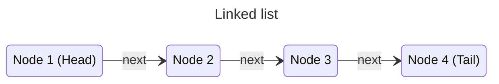

Computer programs solve practically all sorts of problems in all areas, be it business, finance, biology, or physics. For example, a program can find out the shortest path between two nodes in a graph. But programming languages can represent only a few basic data types, like integers, strings, arrays, etc. How does the program understand complex data like a graph?

The techniques of representing data in programs using the basic data types offered by a programming language are called _data structures_. Data structures convert real-world data into a format suitable for processing by a program. Each data structure varies from the other and is suitable for different scenarios.

A few commonly used data structures are the following:

1. Arrays.
2. Stacks.
3. Queues.
4. Linked lists.
5. Maps.
6. Graphs.

## Arrays

???+ question "Problems"
    1. Given an array of integers, check whether the array is _strictly increasing/decreasing_ or _monotonically increasing/decreasing._
    2. Traversal.
        1. Given an array, traverse elements from index $i$ to $j$ in it.
        2. Given an array, traverse $k$ elements starting from index $i$.
            1. What are the indexes of $k$ elements starting from $i$?
        3. Given an array of integers, traverse every $k$-th element of it starting from $0$.
            1. What are the indexes to be traversed?
        4. Given an array of integers, starting from the $k$-th element, traverse all of its elements _circularly_ up to $k - 1$.
        5. Given an array of integers of length $n$, traverse the last $k$ elements of it.
            1. What is the starting index?
    3. Traverse by skipping some elements, keeping a margin/offset.
        1. Given an array of integers, traverse it from the beginning skipping the last $k$ elements.
            1. What is the index of the last element?
        2. Given an array of integers, traverse it from the beginning skipping the first $k$ elements.
    4. Given an array of integers, reverse its elements without taking a new array.
    5. Given an array of integers with length $n$ and another array with length $k < n$, paste the second array into the first one starting from index $i$.
    6. Rotating an array.
        1. Given an array of integers (or anything) and a positive integer $k$ (less than the length of the array), rotate the array _to the right_ by $k$ elements. Example: $[1, 4, 8, 9, 7, 8]$, $k=2$. Answer: $[7, 8, 1, 4, 8, 9]$.
        2. Do the preceding problem, but rotate to the opposite direction, _left_, instead. Example: $[1, 4, 8, 9, 7, 8]$, $k=2$. Answer: $[8, 9, 7, 8, 1, 4]$.

## Linked lists

In the _linked list_ data structure data is organized as sequential _nodes_. Each node contains some data and points (links) to its next node. The first node is called the _head_ of the linked list, and the last node, which points to no node, is called its _tail_.

In order to use a linked list, programmers have to keep track of its head and tail nodes.

### Inserting elements

In a linked list one node is appended to it at a time by updating its tail. The new node becomes the new tail of the list.

### Traversal

Traversing a linked list begins by setting the head as the _current_ node. After that, each time, the current node is updated to the next node until the current node points to nothing.

As we can see, a linked list can be traversed only in a _forward direction,_ where an array can be traversed in both directions. Moreover, in an array, any element can be accessed by its index, whereas in a linked list, a node can be reached only by _traversing all of its preceding nodes._
