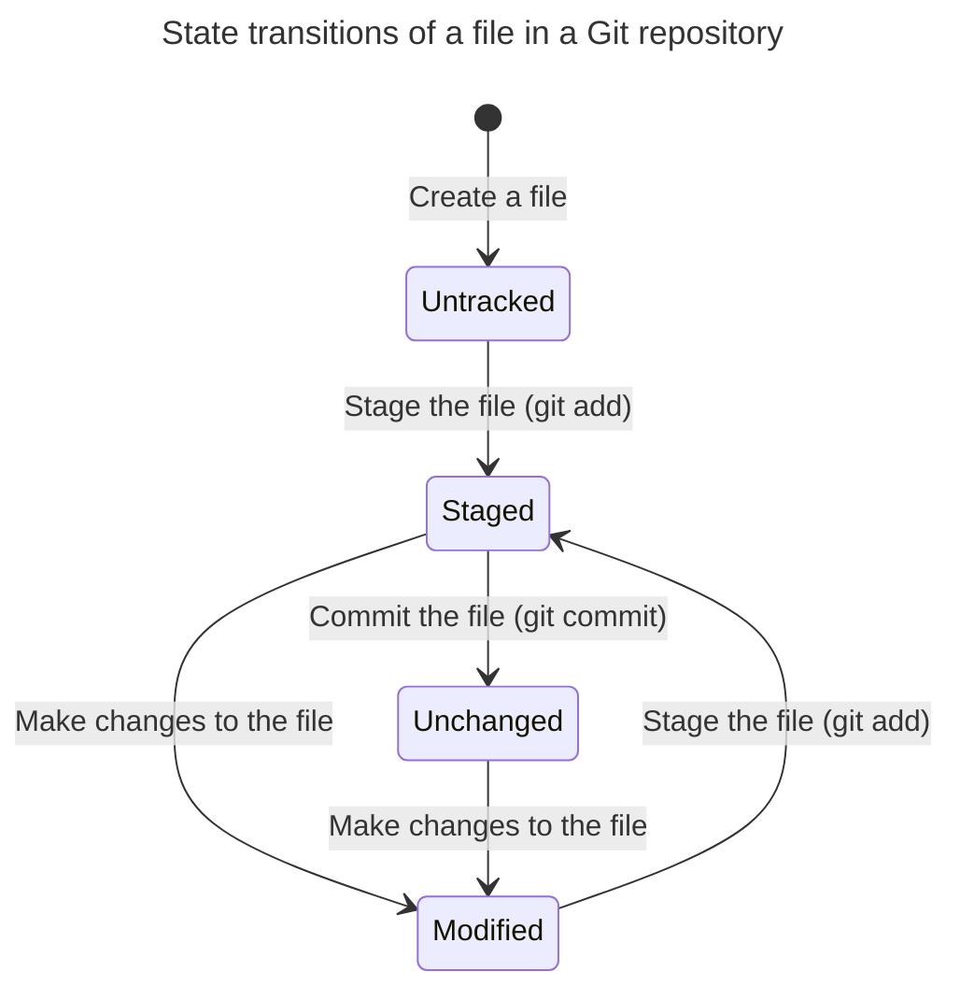
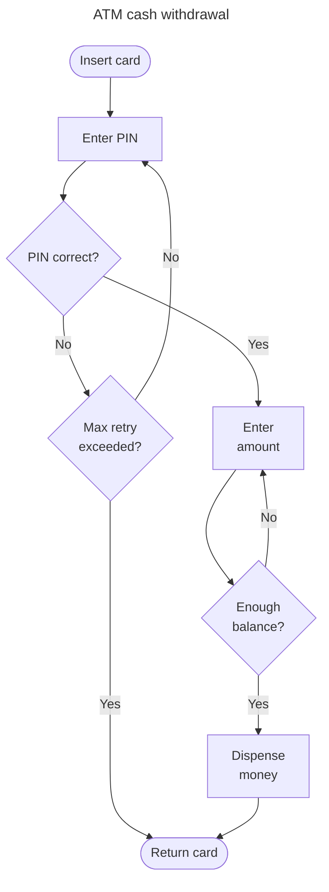

# Mental Models for Programmers

The first step to solving a problem is to express it properly. Expressing complex ideas requires _mental models_, analogies that are similar to ideas. Mental models not only express a problem but also guide your thought and aid your reasoning.

Mental models are also vital in communicating ideas with collaborators.

This page contains a list of commonly used mental models that often serve as analogies while expressing complex ideas.

## Ranges or intervals

### Representing ranges

A range is a set of numbers between two numbers. For example, the range of numbers between $x$ and $y$, where $x \leq y$, is represented as $[x, y]$. The first number, $x$, is called the _lower bound_ of the range and the second number, $y$, is called the _upper bound_ of the range. A range may be _inclusive_ or _exclusive_. For example, the range $[1, 10]$ is inclusive, while $(1, 10)$ is exclusive.

### Common range tasks

* Checking if a number is in a range.
* Finding the intersection or overlap of two ranges.
* Finding the union of two ranges.
* Finding the complement of a range.
* Checking if a range is a subset of another range.
* Shifting a range, cyclically or not.

### Applications of ranges

* **Binary search.** A range represents the search space in binary search algorithm. Initially, the range is the complete array to be searched. In each iteration, binary search halves the search space based on the comparison with the middle element of the range.

## Grids or matrices

### Common grid tasks

* Traversing a grid based on adjacency.

## Associations or maps 

The concept association is found everywhere in real world. Two things are associated means that they are somehow _related to each other._ For example, affixing a price tag to a product is associating the price with the product, meaning that *the product's price* is the *amount printed on the tag.*

Associations may be used for _identification_ (e.g. roll number uniquely identifies a student), for indicating _ownership_ (e.g. labels on parcels), and many other relationships. We can picture associations as arrows pointing from an object to another or from a set of objects to another.

Depending on context, an object may be associated with only one other object (one-to-one) or multiple objects (one-to-many).

Inspired by the mathematical concept of *map* (aka functions) the word map is often used instead of association: for example, the two objects are mapped to each other, a mapping exists between the objects, map this thing to that thing, etc.

### Examples

Developing an ability to identify associations in various scenarios and also expressing them is very important for a programmer.

1. In a dictionary, meanings are associated with a word (one-to-many).
2. Any ID number (e.g. roll numbers, license numbers, national IDs) is associated or mapped with a person (one-to-one).
3. A website is mapped or associated with its domain (e.g. `google.com`, `wikipedia.org`, etc.)
4. A Git local repository may be associated with one or more remotes (one-to-many).

### Associations in programming

Objects (called _records_ in some languages) in programming languages are associative by nature. The properties of an object contain the values associated with it. For example, a student object contains only the information associated with a particular student (e.g. name, class, roll number, etc.)

The *map* data structure (called *dictionary* in some languages) is capable of storing and retrieving associations. A map variable can both associate a *key* with a *value,* and also can find the associated value given the key. The mapping rule (which key is to be associated with which value) is up to the programmer.

## Hierarchy

A hierarchy organizes things at a number of levels. A level is owned by its _parent level_ and it owns its _child levels._ Depending on contexts, different terms are used instead of parent and child levels. Hierarchy is a natural way of organizing things on many occasions. A hierarchy may represent ownership, priority, and many other things.

Hierarchies are often represented with [_trees_](https://en.wikipedia.org/wiki/Tree_structure). Organizing things in hierarchies whenever possible helps understand the relationship among them.

### Examples

1. Staffs in organizations are usually organized in a hierarchy called _organizational chart_, or _organogram_. Staffs at a higher level of hierarchy oversees or supervises the ones at the lower levels of hierarchy; staffs at a lower level of hierarchy reports to those at the higher level.
2. Operating systems organize the files in its disks in a hierarchy called _file tree._ A _parent_ directory owns all the subdirectories and files within it. Deleting a parent directory deletes all its child directories and files too.
3. Table of contents of a book is also a hierarchy. A chapter contains its sections, subsections. It helps readers navigating through the book.
4. In source codes, indentations are used to represent hierarchies. A code block is indented to indicate that it is owned by its parent block.
5. Designers use various [_visual hierarchy_](https://www.interaction-design.org/literature/topics/visual-hierarchy) techniques in designs to indicate priority (e.g. larger or darker texts are more important), help navigation (e.g. a [breadcrumbs](https://careerfoundry.com/en/blog/ui-design/ui-breadcrumbs/)), etc.

## State machines

In any system, objects exist in various _states_; various _actions_ change their states; change from one state to another is called a _transition._ Among all the actions in a system only a few of them are applicable to a state. Some transitions maybe _reversible_, others maybe _irreversible_. For example, in an order delivery system an order maybe in these states: _order received_, _packed_, _cancelled_, _in transit_, _delivered_, etc.

State transitions can be represented with state transition diagrams (aka state machine diagrams) or state transition tables.

### Examples

Identifying the states and transitions in a system help reasoning about the system.

#### The Git version control system

A file in a Git repository can be in the following states: _untracked_, _staged_, _unchanged_, or _modified_. Here follows a state transition diagram that shows how a file's state is changed and which actions cause them. Some transitions are omitted for simplicity.

## Flowcharts

A _system_ consists of one or more _processes_ (also called simply _flows_). A process is a series or sequence of _operations_. One operation may lead to another; there may be decisions between the operations (which operation takes place next).

Processes are everywhere around us. They are represented with *flowcharts*. All operations preceding an operation are called its _upstream_ operations; conversely, all operations following an operation are called its _downstream_ operations.

Every program you write actually implements a flowchart.

### Examples

The following flowchart illustrates a simplified money withdrawal process in an ATM booth. Note that the ATM system is capable of other processes too: checking balance, transferring money, etc. Those processes have their own flowcharts.

