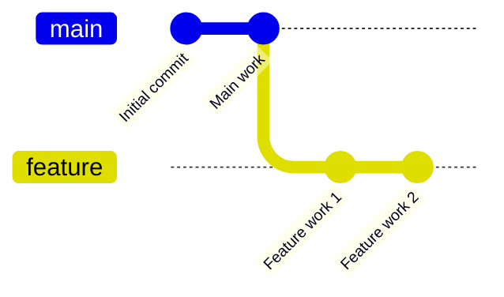

# Version Controlling with Git

Starting with only a few files, a project may eventually grow into a large number of files, and a file may go through a long sequence of changes. As the number of files grows in a project, keeping track of their changes becomes increasingly difficult for developers. A _version control system (VCS)_ is a tool that keeps track of the changes in files. Git is by far the most popular VCS used by developers, though there are a few more, like [Mercurial](https://www.mercurial-scm.org/), [Subversion](https://subversion.apache.org/), etc.

Git serves two major purposes for developers and teams: _history tracking_ and _collaboration._ When a developer works on a project for a long period, it is difficult for him/her to memorize the changes the project files have gone through. Git preserves the file histories as _commits._ It helps developers go through a file's history or the entire repository's history whenever necessary.

Any complex project requires team collaboration. When a team of developers works together on the same project, there must be some means to keep their work in sync among themselves. Git serves this purpose with Git _remotes_, a central Git repository. Developers finish their tasks on their local repositories and _push_ their changes to the remote repository when they are done so that other developers can _pull_ their changes into their local repositories.

See these [pages](https://github.com/git-guides) for a more exhaustive and authoritative treatment of Git.

## Basic Git concepts

### Repository

A directory to be watched for changes by Git is called a repository. Git monitors the repository directory for changes and records the change history as [commits](#commits).

### Commits

Ordinarily, we start a project in an empty directory, and over time it goes through changes. At any instant, we only have the latest state of the directory, but we don't any record of the changes it has gone through. In a Git repository, Git records the changes, and each unit of change recorded by Git is called a _commit._

While working in a repository, the repository user chooses the changes to be recorded, called _staging_. After that, the user asks Git to record the staged changes, called _committing._ Each commit has its automatically generated unique ID. The latest commit is also identified by its alias, `HEAD`. The sequence of commits of a branch in a repository shows the changes the repository has gone through, known as the _commit history_ of the branch.

### Branches

While working on a project, developers often need to work on a new feature without affecting the existing code. In such situations, without a repository, developers would have to create a copy of the project directory, and start working there. Also, whenever they want to work on the existing code, they would have to switch back to the original directory.

Git simplifies this process with _branches._ A branch is a copy of the repository with its own commit history. You can [create new branches](#working-with-branches) and switch between them. Whenever you want to work on a different branch, Git brings the branch copy into your working directory. This is called _checking out_ a branch.

Each branch has its own unique name. At any time, your working directory points to a branch. The default branch, the initial copy of the repository, is called `master`.

???+ warning
    **The new `main` and the old `master` branches in GitHub**

    A Git repository starts with an initial or default branch called `master`. But due to some [cultural controversies](https://www.theserverside.com/feature/Why-GitHub-renamed-its-master-branch-to-main) with the name _master_, GitHub has adopted a new convention: when you create a new repository in GitHub, its default branch is `main` instead of the old `master`.

    But the default branch name is still `master` when you create a local repository with the Git desktop client (with the `git init` command). So, as GitHub has renamed its default branch name to `main`, you have a problem when you add a GitHub repository as its remote: when you push to GitHub, changes are pushed to the `master` branch instead of the `main` branch. As a remedy, you can rename your local `master` branch to `main` before adding remote or pushing: `git branch -m main`.

### Remotes

A Git _remote_ is a server that contains a copy of a Git repository, including all of its branches, commits, and files. After working on a local repository, you can _push_ your changes to a remote periodically so that other developers can access your changes. Similarly, you can _pull_ changes from a remote repository to keep your local repository up to date with the latest changes made by others.

Git remotes has two main benefits:

* _Backup._ If your computer crashes, you can always recover your work from the remote repository.
* _Collaboration._ If you are working in a team, you can share your changes with your teammates by pushing to the remote repository.

## The Git workflow

This section gives an overview of how Git is used by developers. Before using Git on your computer, [download](https://git-scm.com/downloads) and install it.

### Creating a local Git repository

You can turn any directory on your computer into a Git repository. In order to do so, open Git Bash in an existing directory or in a newly created one, and run the `git init` command. This command creates a `.git` subdirectory into the directory. As a result, the directory turns into a Git repository with `master` as the default _branch_.

After creating a repository, you have to set your user name and email address with the following commands. The username and email address tell Git it is you who is working in the repository and they are associated with your commits.

```
git config --global user.name "Your Name"
git config --global user.email "youremail@yourdomain.com"
```

???+ info
    **The `--global` flag in the `git config` command**

    The `--global` flag in the `git config` command is optional. If you set the flag, the options you are setting become global in your computer; that is, all the repositories you create in the future on your computer use these config values (e.g. username and email address); you don't need to set them again. See this [resource](https://docs.github.com/en/get-started/getting-started-with-git/setting-your-username-in-git) for a detailed discussion.

After setting the username and email address, you have a working _local repository._ You can start working in your repository: staging, committing, etc.

???+ info
    **The `.git` subdirectory**

    The `.git` subdirectory is used by Git for repository management; users never need to view or modify the contents in it. If you delete the `.git` subdirectory, even if keeping the other contents in it intact, your directory no longer remains a Git repository: all Git repository information about the directory will be lost and Git commands will no longer work in the directory.


### Git ignore

Git continually tracks every file and directories under its repository directory. If a file is already _tracked_ (staged once with the `git add` command), it tracks the _changes_ that took place within it; it treats other files and directories as _untracked_ and assumes they will be tracked eventually.

However, in a repository, some files' and directories' histories are neither important nor of any interest to the collaborators, thus they do not deserve versioning. Still, Git keeps treating them as untracked, causing confusion to developers when they want to check for changes before committing. Developers are overwhelmed by the list of untracked files, and they might stage unwanted files and commit them by mistake. The repository user has to mark such files and directories as to be ignored in a file called `.gitignore`, usually at the repository root. Here follows an example Git ignore file.

<div class="annotate" markdown>
```txt
node_modules/ (1)
some-file.txt (2)
some-dir/sub-dir/another-file.txt (3)
*.png (4)
```
</div>

1. Ignore the `node_modules` subdirectory, all files and sub-directories within it.
2. Ignore the specific file `some-file.txt` at the project root.
3. Ignore the specific file `another-file.txt` in the `some-dir/sub-dir/` subdirectory.
4. Ignore all `png` files in the repository.

Consult this [resource](https://www.atlassian.com/git/tutorials/saving-changes/gitignore) for further details on Git ignore.

### Working with branches

A new branch is created with the `git branch <branch-name>` command. A new branch starts from the current commit of the current branch. Therefore, the new branch and its source branch have a common history up to the branch creation commit. Creating a branch is like copying the working directory to a new location and starting to work there. Branches are usually merged back into their source branches eventually.

Switching between different branches is done with the `git checkout <branch-name>` command. Git brings the working directory to the state of the branch you switched to. Conceptually, it is like Git keeps copies of the repository in branches, and when you switch branches, it brings the copy of the branch you switched to into the working directory.

In the following example diagram, a branch called `feature` is created from the `main` branch, which conceptually copies the working directory to a new location. After that, some commits are made in the new branch, meaning the changes are made in the copied working directory, whereas the `main` branch remains unchanged. If you switch back to the `main` branch, the working directory is brought back to the state of the `main` branch, which does not include the changes made in the `feature` branch. 



### Working with remotes

The changes you make in your repository, that is your commits, remain local in your computer until you push them to a [remote](#remotes), a shared central repository. We can either start by creating a local repository first and then associating it with a remote, or we can clone an existing remote repository.

#### Setting up Git remotes in local repositories

For repositories without an existing remote, you have to create a remote repository first in GitHub or in any other such provider (e.g. [GitLab](https://about.gitlab.com/), [Bitbucket](https://bitbucket.org/), etc.) After creating the repository in GitHub, copy its link and associate it as a remote in your local repository with the following command:

<div class="annotate" markdown>
```
git remote add origin(1) https://github.com/OWNER/REPOSITORY.git(2)
```
</div>

1. Name of the remote. A local repository may have multiple remotes with their unique names; the default remote name is `origin`.
2. Link to the remote repository. You can find it in the repository webpage.

After associating a remote with your local repository, whenever you push your commits to the remote, your changes become visible to other users who have access to the same remote repository.

You don't need to associate your repository with a remote if you never want to share your work with others.

#### Creating local repositories with Git clone

Sometimes, you may want to work on a remote repository already created by someone else. In that scenario, you can copy the remote repository into your computer with the Git clone command and start working in it.

```
git clone https://github.com/github/training-kit.git
```

This command creates a copy or clone of the remote repository in your computer. It also _automatically sets the remote repository_ as the `origin` remote; you don't need to do it manually.
